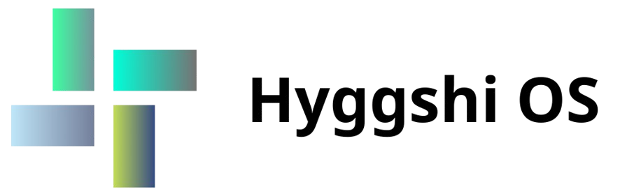

> ⚠️ *Note: GitHub says this project is 98.8% written in Luau, but that's a slight deception. Don't believe everything you see in the green bar!*

# Hyggshi OS Developer



[](https://github.com/HyggshiOSDeveloper/Hyggshi-OS-project-center/releases)


Hyggshi OS Developer là một dự án phát triển hệ điều hành dựa trên Roblox Studio. Mục tiêu là cung cấp giao diện và chức năng độc đáo cho người dùng.

## Đặc trưng
- Giao diện đẹp mắt.
- Tính năng nhắn tin Zashi.
- Tích hợp tính năng timeout màn hình.


## Cài đặt
1. Sao chép kho lưu trữ này:
```bash
git clone https://github.com/HyggshiOSDeveloper/Hyggshi-OS-project-center.git
```
## Tuân thủ
[](https://github.com/ROBLOX)

Sản phẩm này không vi phạm các tiêu chuẩn của Roblox hoặc bên thứ ba và là sản phẩm không chính thức. Sản phẩm này không được phát hành bởi bất kỳ nhóm hoặc tổ chức chuyên nghiệp nào. Một số ý tưởng dựa trên Windows, hệ điều hành thực hoặc các hệ điều hành khác, bao gồm cả trong trò chơi. Ý tưởng và kịch bản bắt đầu vào năm 2023. Hiện tại, dự án có các phiên bản sau:

Hyggshi OS 1.3

Hyggshi OS 2.1

Hyggshi OS Developer

Hyggshi OS Center

Hyggshi OS 1.5 Pro
